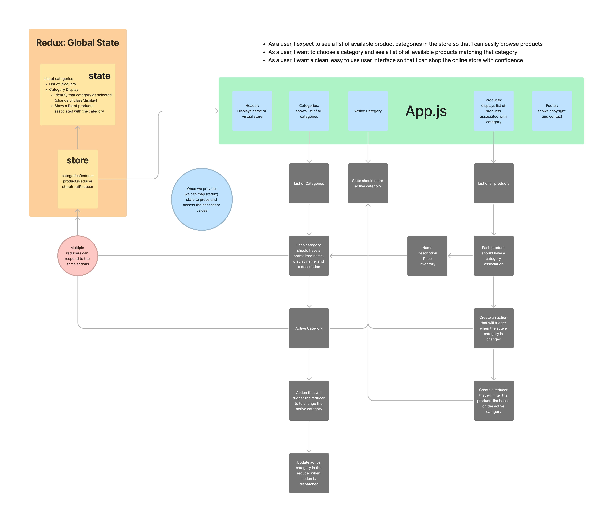
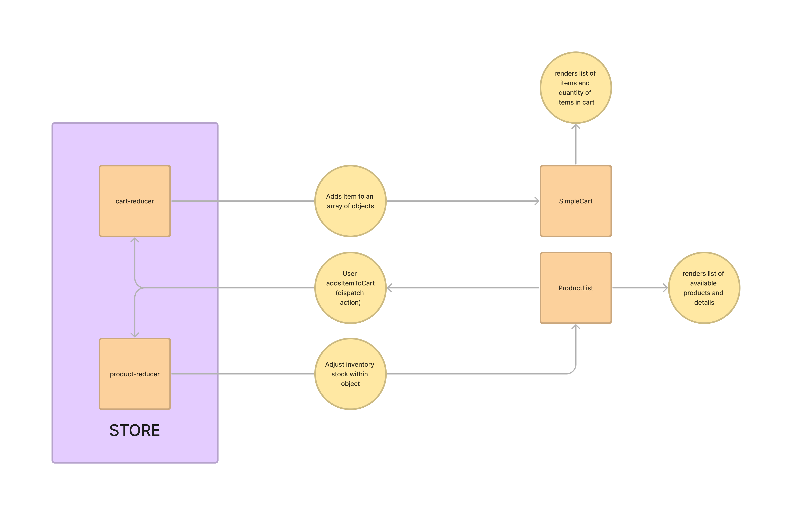

# Storefront

## Author: Stephanie Hill

## Phase One

### Branch: redux

### Functionality

- Redux Store houses initial state & presently hardcoded data set
  - This data object includes an array where individual products are assigned to a broader category
- Our Categories Component is home to buttons that use a filter category action to set state
  - Once this specific action is dispatched, it sets an active category within our reducer
- Once state is set, our List Component filters through the products and displays those the correspond based upon active category
- List items are rendered on a card via Material UI
  - Each card displayd the product name, price and quantity in inventory

## Phase Two

### Branch: combined-reducers

### Additional Functionality

- New reducer in the Store to handle items in cart
- When user adds item to cart, the combined reducers update the quantity in the cart as well as the inventory of the specified item accordingly
- When item removes item, state (both in cart and inventory) is updated accordingly based on product removed from cart
- Cart items are displayed via a dropdown list rendered in a new component called Simple Cart

## Phase Three

### Branch: thunk

### Dependencies

- [Redux](https://redux.js.org/)
- [React Redux](https://react-redux.js.org/)
- [Redux DevTools](https://github.com/reduxjs/redux-devtools/tree/main/extension)
- [MUI Core](https://mui.com/core/)
- [Thunk](https://github.com/reduxjs/redux-thunk)
- [Redux Toolkit](https://redux-toolkit.js.org/)

### Links

- [Code Sandbox](https://codesandbox.io/p/github/stephnitis/storefront/main?file=%2Fsrc%2FApp.js&workspace=%257B%2522activeFileId%2522%253A%2522cla7be85m000kl2jx2hdlct0f%2522%252C%2522openFiles%2522%253A%255B%255D%252C%2522sidebarPanel%2522%253A%2522EXPLORER%2522%252C%2522gitSidebarPanel%2522%253A%2522COMMIT%2522%252C%2522sidekickItems%2522%253A%255B%257B%2522type%2522%253A%2522PREVIEW%2522%252C%2522taskId%2522%253A%2522start%2522%252C%2522port%2522%253A3000%252C%2522key%2522%253A%2522cla7bevsc00oo3b6hj9brqjtg%2522%252C%2522isMinimized%2522%253Afalse%257D%252C%257B%2522type%2522%253A%2522TASK_LOG%2522%252C%2522taskId%2522%253A%2522start%2522%252C%2522key%2522%253A%2522cla7besgz00lv3b6hak0dphjn%2522%252C%2522isMinimized%2522%253Afalse%257D%255D%257D)

### References

- [Demo Code](https://github.com/codefellows/seattle-code-javascript-401d48/tree/main/class-36)